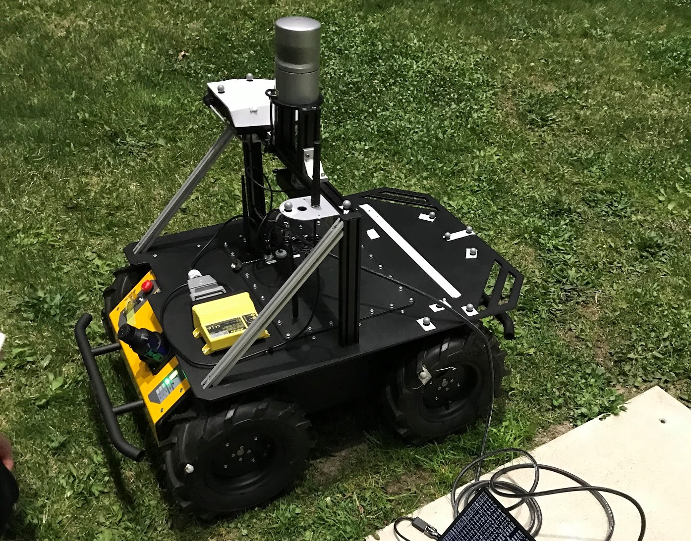
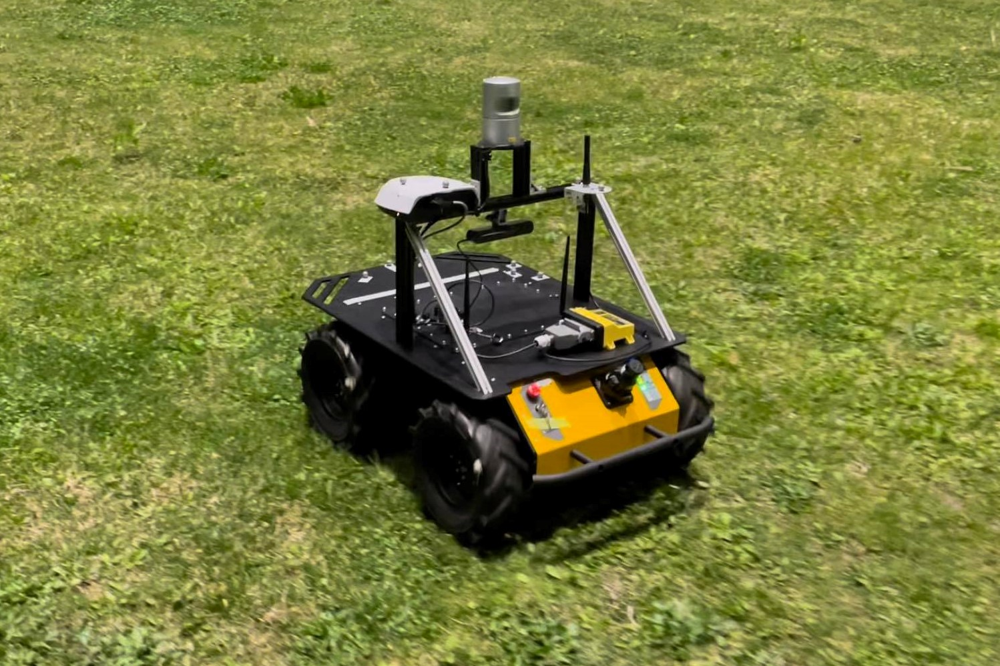
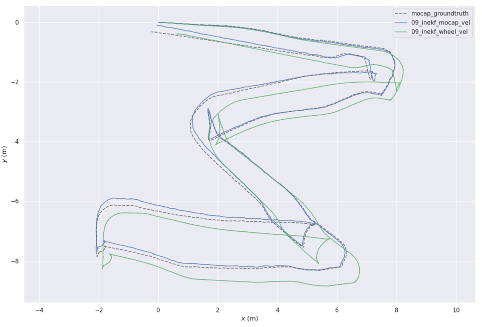
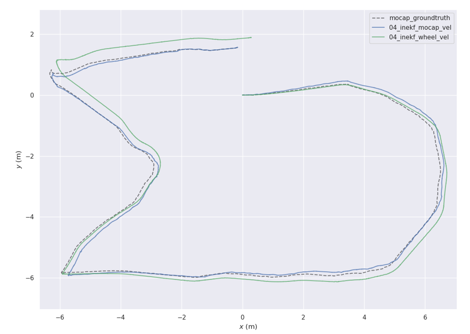

# husky_inekf
This project contains an Invariant Kalman Filter system for wheeled robot state estimation. The InEKF takes in IMU measurement and body velocity estimation and estimates the robot's pose, velocity, and IMU biases.

## Results
<p float="left">
  
   
</p>
<b>Figure 1:</b> Setup for the Husky experiments. Markers are attached on the robot body and a motion capture system is used to track the ground truth robot pose.

<p float="left">
  
</p>

<b>Figure 2:</b> Estimated trajectory of the Husky robot on the grass M dataset. Dash line: ground truth trajectory from a motion capture system. Green line: InEKF result with velocity correction from wheel encoders. Blue line: InEKF result with velocity correction from the motion capture system.


<p float="left">
   
</p>

<b>Figure 3:</b> Estimated trajectory of the Husky robot on the grass UM dataset. Dash line: ground truth trajectory from a motion capture system. Green line: InEKF result with velocity correction from wheel encoders. Blue line: InEKF result with velocity correction from the motion capture system.

## Dependencies
* ROS
* Eigen3
* Boost

## Setup
1. This project is a ROS package. 
   
   To build to program, clone the project under `~/${PATH_TO}/catkin_ws/src` and follow the bellow commands:
```
cd ~/${PATH_TO}/catkin_ws/
catkin_make -j8
source devel/setup.bash
```
1. To run the program, you can use the following command:
```
roslaunch husky_inekf husky_estimator.launch
```

## Configuration
### Filter settings can be modified in `config/settings.yaml`:
#### **Input topics**

   * `imu_topics`: Input topics for IMU messages. (`sensor_msgs::Imu`).
  
   * `joint_topic`: Input topics for wheel encoders. (`sensor_msgs::JointState`).

#### **Velocity Modality**

The program support simultaneously correction from 3 different velocity topics. Each has a flag to enable/disable. If enable more than 1, the filter will be corrected sequentially when the message is received.

  * Wheel velocity correction. (`sensor_msgs::JointState`).

    * `enable_wheel_velocity_update`: Enable this will enable the velocity correction from wheel encoders. 
    
        The velocity is computed from: *v_body = (v_right_wheel + v_left_wheel)/2*, and  *v_wheel = angluar_velocity * wheel_radius*.

    * `wheel_velocity_topic`: Topics for velocity input. (`sensor_msgs::JointState`).
  
    * `wheel_radius`: Wheel radius (m). 
  
    * `vehicle_track_width`: Distance between right and left wheel (m).

    * `vehicle_length`: 0.540 # distance between forward and back wheel centers (m).

  * Velocity from camera odometry. (`nav_msgs::Odometry`).
  
    * `enable_camera_velocity_update`: Enable this, the filter will take the difference between two pose and compute the velocity from it.
  
    * `camera_velocity_topic`: Topics for odometry input. (`nav_msgs::Odometry`)

  * Velocity from `geometry_msgs::TwistStamped`.
  
    * `enable_gps_velocity_update`: Enable this the filter will use velocity from the topic to correct the state.
  
    * `gps_velocity_topic`: Topic for the velocity input. (`geometry_msgs::TwistStamped`)

### **Filter Settings**

* `static_bias_initialization`: Enable static bias initialization using the first 250 measurements from IMU with the assumption of robot being static. If you disable this, remember to set the bias priors in `config/prior.yaml`. 
  
* `init_bias_using_orientation_est_from_imu`: Enable this the filter will use the orientation estimated from the imu to initialize bias. Setting this to false the filter will assume the robot to be horizontally static (gravity pointing downwards) to initialize the filter.  
  
* `velocity_time_threshold`: Threshold for time difference between the received velocity message and current time (sec). The message will be dropped if the time difference is larger than this threshold.

### **Frame Definition**

We assume the body frame to be at the imu position. (X pointing forward, Y to the left, Z pointing up.)
  * `rotation_body_imu`: Orientation from IMU to the body frame. Quaternion `[w,x,y,z]`.

  * `rotation_cam_imu`: Orientation from camera to the body frame. Quaternion `[w,x,y,z]`.
  
  * `translation_cam_imu`: Translation from camera to the body frame. `[x,y,z]`.

### **Logger**
We provide functions to log the estimated pose, velocity, and biases.

* `enable_pose_logger`: Enable this will write down the estimated pose, velocity, and biases in a txt file.
  
* `log_pose_skip`: Number of pose to be skipped while recording. Ex. Set to 100 the program will record every 100 poses.
  
* `inekf_pose_filename`: Path for the logged txt file in the [TUM format](https://vision.in.tum.de/data/datasets/rgbd-dataset/file_formats).
  
* `inekf_vel_est_file_name`: Path for the velocity log file.
  
* `inekf_bias_est_file_name`: Path for the bias log file.
  
  


## Visualize InEKF in Rviz
1. Start running the husky estimator using the instructions above
2. Enter `rviz` in the terminal
2. Select `Add by topic` setting and select path
3. Changed fixed frame to the same value as `map_frame_id` in `config/settings.yaml`
4. The robot pose should begin being drawn in rviz
